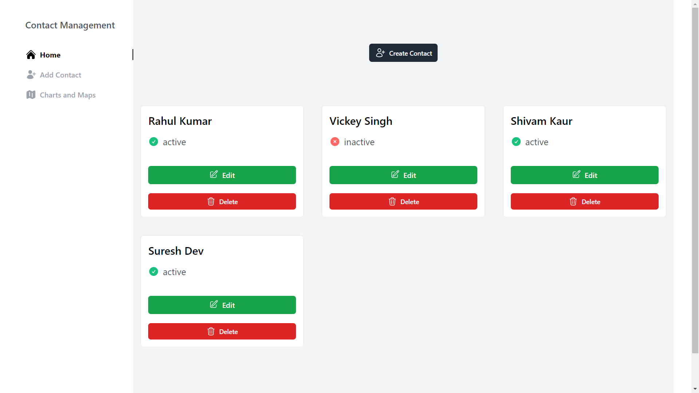

# Contact Management with Charts and Maps

  
  
  

This is a React web application that provides contact management functionality along with data visualization using charts and maps.

## Technologies Used

- React
- React Router
- Tailwind CSS
- TypeScript
- Chart.js
- React Leaflet
- Redux Toolkit (for contact management)
- Tenstack React Query (for API data fetching)

## Features

- Add, edit, and delete contacts.
- View a dashboard with worldwide data.
- Daily data visualization using a line chart.
- Country-wise data visualization using an interactive map.
- Popups on map markers displaying death, recovery, and active cases.
